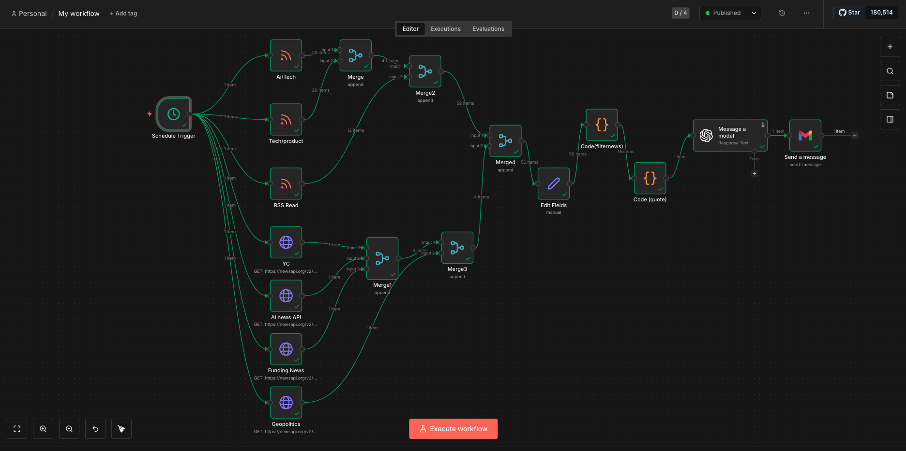

# Daily-AI-Brief-Agent

## Overview

A personalized system that aggregates, filters, and summarizes real-time signals across AI, startup funding, and geopolitics into a concise daily briefing.

Built using n8n, APIs, and OpenAI to transform noisy data into actionable insights.

## Problem

Information across AI, startups, and global markets is fragmented and noisy. It’s difficult to identify what truly matters without spending hours consuming content.

As a master's student, international student, and active job seeker, I needed a way to stay informed without burning out or constantly context-switching.

## Solution

I built a system that automatically:

- Collects data from multiple sources (RSS feeds, APIs)
- Filters out low-signal and repetitive content
- Prioritizes relevant updates (AI trends, funding, geopolitics)
- Generates a structured daily briefing using AI
- Delivers a clean, readable email every morning

## What the System Delivers

Each morning, the system sends a brief with:

- **AI Updates** — key product launches, model updates, and trends  
- **Startup Funding** — high-signal rounds, with focus on YC and Sequoia-backed companies  
- **Geopolitics** — major global developments and their implications  
- **What This Means** — practical insights for career and skill direction  
- **Watchlist** — what to keep an eye on next  

## How It Works

1. Collect data from RSS feeds and news APIs  
2. Merge and clean structured inputs  
3. Filter and prioritize high-signal updates  
4. Add a rotating motivational line  
5. Use OpenAI to generate a concise HTML briefing  
6. Send the final output via email every morning  

## Architecture

## Example Output

## Tech Stack

- n8n (workflow automation)
- OpenAI API (LLM-based summarization)
- News APIs + RSS feeds
- Gmail OAuth2

## Key Features

- Multi-source data aggregation  
- Signal-over-noise filtering  
- Deduplication and prioritization  
- AI-powered structured summaries  
- Personalized daily briefing  
- Fully automated delivery  

## What I Learned

- Defining what “signal” actually means is harder than building the system  
- Prompt design significantly impacts output quality and structure  
- Automation is only valuable when paired with strong filtering logic  
- Building systems > building features  

## Future Improvements

- Add startup hiring signals and job tracking  
- Track recurring companies and emerging trends  
- Build a dashboard version (Notion / web app)  
- Add weekly intelligence summaries  

---

## Files

- `workflow.json` → exported n8n workflow  
- `images/workflow.png` → system architecture  
- `images/sample-email.png` → example output  
